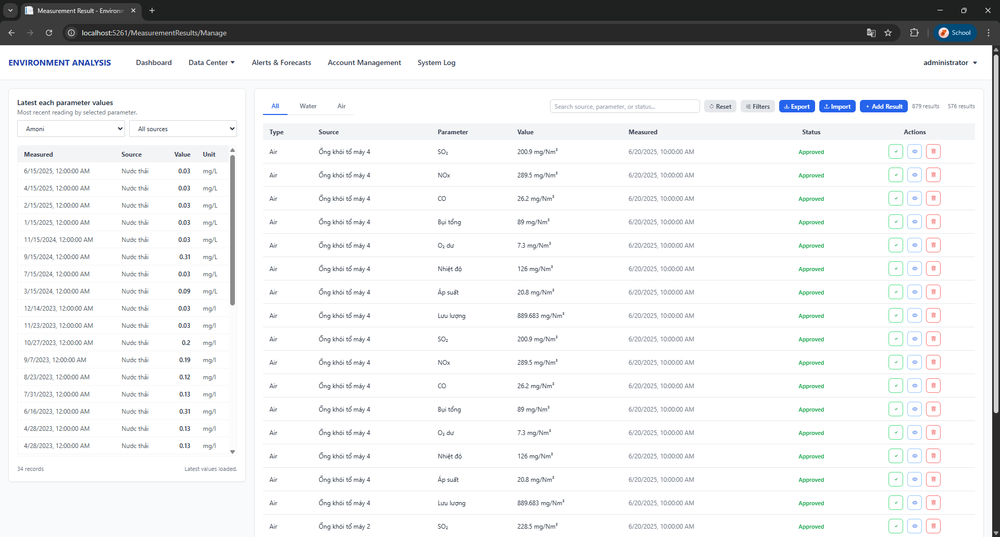

# Environment Analysis


Professional web platform for environmental monitoring, forecasting, and compliance management.  
The system centralizes emission sources, parameters, measurement results, alerts, and audit trails in a single operational workspace.

## Key Use Cases (From Controllers)

- Dashboard overview of sources and parameters for quick navigation and trends (`HomeController`)
- Alerts & Forecasts: threshold context and predictive analysis by source/parameter (`AlertsForecastsController`)
- Emission Sources: CRUD, soft delete/restore, and detail APIs (`EmissionSourcesController`)
- Source Types: manage categories, descriptions, and active status (`SourceTypesController`)
- Parameters: manage catalogs, export CSV, and query latest measurements (`ParametersController`)
- Measurement Results: bulk import preview/confirm, approval tracking, trend charts, and CSV export (`MeasurementResultsController`)
- Pollution Prediction: upload CSV for model-based prediction output (`PollutionController`)
- Source Management workspace with CSV export (`SourceManagementController`)
- System Logs: admin-only audit trail with filters and export (`SystemLogController`)
- User Management: admin-only user CRUD, role assignment, soft delete/restore (`UserManagementController`)

## Alerts & Forecasts


## Measurement Results



## Security & Access

- ASP.NET Core Identity with JWT stored in HTTP-only cookies
- Role-based access control with admin-only areas guarded by `[Authorize]`
- Anti-forgery tokens for state-changing endpoints
- Activity logging for key data mutations and administration actions
- Soft-delete patterns on core entities to preserve auditability

## Tech Stack

<p>
  
  
  
  
  
  
  
  
  
  
</p>

## Local Setup
### Prerequisites
- .NET SDK 8.0
- SQL Server (LocalDB or full instance)
- Optional: `dotnet-ef` global tool for migrations

### Run Locally
1. Restore dependencies:
   ```bash
   dotnet restore env-analysis-project/env-analysis-project.csproj
   ```
2. Create your `appsettings.json` (ignored by git):
   ```powershell
   Copy-Item env-analysis-project/appsettings.template.json env-analysis-project/appsettings.json
   ```
3. Update secrets in `appsettings.json`:
   - Connection string `env_analysis_projectContext`
   - `Jwt:Key` with a long random value (32+ chars)
4. Apply migrations:
   ```bash
   dotnet ef database update --project env-analysis-project/env-analysis-project.csproj --startup-project env-analysis-project/env-analysis-project.csproj
   ```
5. Run the app:
   ```bash
   dotnet run --project env-analysis-project/env-analysis-project.csproj
   ```

### Default Admin Account
- Email: `admin@gmail.com`
- Password: `12345678`

Change credentials immediately in production.
